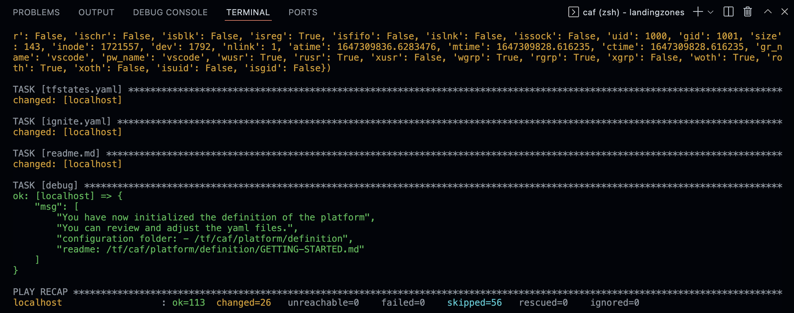

# Single subscription deployment lab

## Objectives

Purpose of this lab is to get you started with a mono-subscription environment which will deploy full features and will allow you to experiment landing zones mechanisms and cross-state composition. It will create a platform definition you can then customize to your needs showing you a single Azure region with a production and non_production environment.


## Required privileges

:::note
To deploy the platform landing zones, you need the following privileges

Azure Active Directory:

- Global Administrator

Azure subscriptions:

- 1 subscription with owner privileges.

Management groups:

- "management group contributor" permissions on a branch or root management group.

:::

## Login to Azure

First step is to login to your Azure environment, you can simply run

```bash
➜  rover login

  /$$$$$$   /$$$$$$  /$$$$$$$$       /$$$$$$$
 /$$__  $$ /$$__  $$| $$_____/      | $$__  $$
| $$  \__/| $$  \ $$| $$            | $$  \ $$  /$$$$$$  /$$    /$$/$$$$$$   /$$$$$$
| $$      | $$$$$$$$| $$$$$         | $$$$$$$/ /$$__  $$|  $$  /$$/$$__  $$ /$$__  $$
| $$      | $$__  $$| $$__/         | $$__  $$| $$  \ $$ \  $$/$$/ $$$$$$$$| $$  \__/
| $$    $$| $$  | $$| $$            | $$  \ $$| $$  | $$  \  $$$/| $$_____/| $$
|  $$$$$$/| $$  | $$| $$            | $$  | $$|  $$$$$$/   \  $/ |  $$$$$$$| $$
 \______/ |__/  |__/|__/            |__/  |__/ \______/     \_/   \_______/|__/


              version: aztfmod/rover:1.1.6-2202.2503

@calling verify_azure_session

Checking existing Azure session
Login to azure with tenant terraformdev.onmicrosoft.com
WARNING: To sign in, use a web browser to open the page https://microsoft.com/devicelogin and enter the code D9SPMXLU4 to authenticate.

```

Click on the URL [https://microsoft.com/devicelogin](https://microsoft.com/devicelogin), set the code and authenticate with your Azure Account.

When the login is successful, you see the rover displaying the context of your Azure environment. Verify everything is correct.

```bash
Set default subscription to 558a029f-aba1-47ff-b620-1d01350e2dd5
Checking existing Azure session
@calling process_target_subscription
Set TF_VAR_tfstate_subscription_id variable to current session's subscription.
caf_command login
target_subscription_id 558a029f-aba1-47ff-b620-1d01350e2dd5
TF_VAR_tfstate_subscription_id 558a029f-aba1-47ff-b620-1d01350e2dd5
Resources from this landing zone are going to be deployed in the following subscription:
{
  "environmentName": "AzureCloud",
  "homeTenantId": "6700cd11-1a2f-42e9-9ef4-1a919dd66613",
  "id": "558a029f-aba1-47ff-b620-1d01350e2dd5",
  "isDefault": true,
  "managedByTenants": [],
  "name": "contoso-management",
  "state": "Enabled",
  "tenantId": "6700cd11-1a2f-42e9-9ef4-1a919dd66613",
  "user": {
    "name": "user@terraformdev.onmicrosoft.com",
    "type": "user"
  }
}
debug: 558a029f-aba1-47ff-b620-1d01350e2dd5
Tfstates subscription set to 558a029f-aba1-47ff-b620-1d01350e2dd5 (contoso-management)


mode                          : 'login'
terraform command output file : ''
terraform plan output file    : ''
directory cache               : '/home/vscode/.terraform.cache'
tf_action                     : ''
command and parameters        : ''

level (current)               : 'level0'
environment                   : 'sandpit'
workspace                     : 'tfstate'
terraform backend type        : 'azurerm'
tfstate                       : ''
tfstate subscription id       : '558a029f-aba1-47ff-b620-1d01350e2dd5'
target subscription           : 'contoso-management'
CI/CD enabled                 : 'false'
Symphony Yaml file path       : ''
Run all tasks                 : 'true'
TF_IN_AUTOMATION              : 'true'

@calling process_actions

You can deploy a landingzone with the rover by running:
  rover -lz [landingzone_folder_name] -a [plan|apply|destroy|validate|refresh|graph|import|output|taint|untaint|'state list'|'state rm'|'state show']

@calling clean_up_variables
cleanup variables
clean_up backend_files
➜  caf git:(main) ✗
```

You can review rover output confirming the authenticated context for AAD and for subscription, as well as the possible next commands.

## Create the definition template on your work environment

Let's now pick the right configuration files example from the landing zones and put it in our configuration repository.

Just run the following command:

```bash
'/tf/caf/landingzones/templates/platform/deploy_platform.sh'
```

The first time you run the command, you will be prompted a couple of simple questions as follow:

```bash
[WARNING]: No inventory was parsed, only implicit localhost is available
[WARNING]: provided hosts list is empty, only localhost is available. Note that the implicit localhost does not match 'all'
Set the short version of your customer name with no spaces [contoso]:
Set the Azure Terraform SRE Environment value [contoso]:
Set the prefix to add to all resource. [caf]:
Management group prefix (value must be between 2 to 10 characters long and can only contain alphanumeric characters and hyphens). [es]:
Management group name [Contoso]:
Email address to send all notifications [email@address.com]:
Azure regions (lowercase, short version) [{'region1': 'southeastasia', 'region2': 'eastasia'}]:
Default Azure Terraform SRE region key [region1]:
```

When completed you can go the launchpad readme.



## Review and customize the definition files

```bash

/tf/caf/platform/definition/GETTING-STARTED.md

```

The definition files are now generated. The consist in a set of YAML files that will be easy to get you started.

## Trigger the rover ignite

After this step you will have to follow the readme.md located in your repository (**/tf/caf/platform/definition/GETTING-STARTED.md**) and follow the instructions. The first step to generate the Terraform configuration files and customized readme with rover ignite:

```bash
ansible-playbook /tf/caf/landingzones/templates/ansible/ansible.yaml \
  --extra-vars "@/tf/caf/platform/definition/ignite.yaml"
```

The output of the ignite will start creating the target configuration folder structure and Terraform files as follow:

```bash
TASK [[level0-launchpad] Clean-up directory] *************************************************************
skipping: [localhost]

TASK [[level0-launchpad] Creates directory] **************************************************************
changed: [localhost]

TASK [[level0-launchpad] - resources - resource_groups] **************************************************
changed: [localhost] => (item=/tf/caf/landingzones/templates/resources/resource_groups.tfvars.j2)

TASK [[level0-launchpad] launchpad] **********************************************************************
changed: [localhost] => (item=dynamic_secrets)
changed: [localhost] => (item=global_settings)
changed: [localhost] => (item=keyvaults)
changed: [localhost] => (item=landingzone)
changed: [localhost] => (item=role_mappings)
changed: [localhost] => (item=storage_accounts)

TASK [[level0-launchpad] Clean-up identity files] ********************************************************
skipping: [localhost] => (item=azuread_api_permissions)
skipping: [localhost] => (item=azuread_applications)
skipping: [localhost] => (item=azuread_group_members)
skipping: [localhost] => (item=azuread_groups)
skipping: [localhost] => (item=azuread_roles)
skipping: [localhost] => (item=keyvault_policies)
skipping: [localhost] => (item=service_principals)

TASK [[level0-launchpad] lauchpad - identity - service_principal] ****************************************
changed: [localhost] => (item=azuread_api_permissions)
changed: [localhost] => (item=azuread_applications)
changed: [localhost] => (item=azuread_group_members)
changed: [localhost] => (item=azuread_groups)
changed: [localhost] => (item=azuread_roles)
changed: [localhost] => (item=keyvault_policies)
changed: [localhost] => (item=service_principals)

TASK [[level0-launchpad] Deploy the launchpad] ***********************************************************
skipping: [localhost]

TASK [[level0-launchpad] Get tfstate account name] *******************************************************
changed: [localhost]
```

:::note
On the first execution of the rover ignite command, you will notice some red errors. It is expected as nothing has been deployed yet and the rover ignite is trying to find the launchpad and the services already deployed.

```bash
TASK [[level0-launchpad] Get launchpad tfstate details] **************************************************
fatal: [localhost]: FAILED! => {"changed": true, "cmd": "az storage blob download  --name \"caf_launchpad.tfstate\"  --account-name \"\"  --container-name \"tfstate\"  --auth-mode \"login\"  --file \"~/.terraform.cache/launchpad/caf_launchpad.tfstate\"\n", "delta": "0:00:01.796026", "end": "2022-01-20 10:12:52.623103", "msg": "non-zero return code", "rc": 1, "start": "2022-01-20 10:12:50.827077", "stderr": "ERROR: \nMissing credentials to access storage service. The following variations are accepted:\n    (1) account name and key (--account-name and --account-key options or\n        set AZURE_STORAGE_ACCOUNT and AZURE_STORAGE_KEY environment variables)\n    (2) account name and SAS token (--sas-token option used with either the --account-name\n        option or AZURE_STORAGE_ACCOUNT environment variable)\n    (3) account name (--account-name option or AZURE_STORAGE_ACCOUNT environment variable;\n        this will make calls to query for a storage account key using login credentials)\n    (4) connection string (--connection-string option or\n        set AZURE_STORAGE_CONNECTION_STRING environment variable); some shells will require\n        quoting to preserve literal character interpretation.", "stderr_lines": ["ERROR: ", "Missing credentials to access storage service. The following variations are accepted:", "    (1) account name and key (--account-name and --account-key options or", "        set AZURE_STORAGE_ACCOUNT and AZURE_STORAGE_KEY environment variables)", "    (2) account name and SAS token (--sas-token option used with either the --account-name", "        option or AZURE_STORAGE_ACCOUNT environment variable)", "    (3) account name (--account-name option or AZURE_STORAGE_ACCOUNT environment variable;", "        this will make calls to query for a storage account key using login credentials)", "    (4) connection string (--connection-string option or", "        set AZURE_STORAGE_CONNECTION_STRING environment variable); some shells will require", "        quoting to preserve literal character interpretation."], "stdout": "", "stdout_lines": []}
...ignoring

TASK [[level0-launchpad] Get subscription_creation_landingzones details] *********************************
skipping: [localhost]

```

:::

## Deploy launchpad (level0)

Go to the /tf/caf/configuration/contoso/platform/level0/launchpad/readme.md


## Next steps

Once launchpad is deployed, follow the next steps as indicated into the readme.md file of your configuration folder. This file has been crafted specially with the settings you entered in the YAML files, so after review.

Once level 0 is completed, you can carry on with level 1: management, identity, then alz. Once level 1 is completed, level 2 azure subscription vending machine (asvm) and identity can be deployed, alongside with connectivity components stating with virtual WAN.
