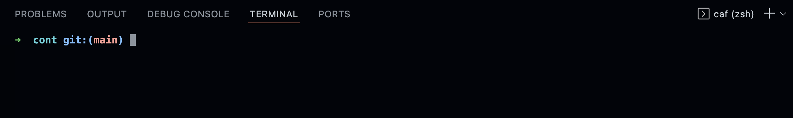
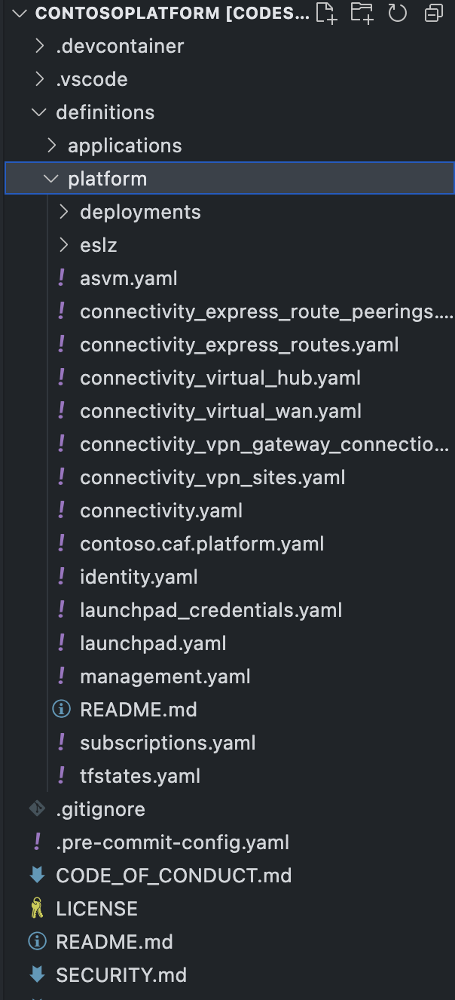
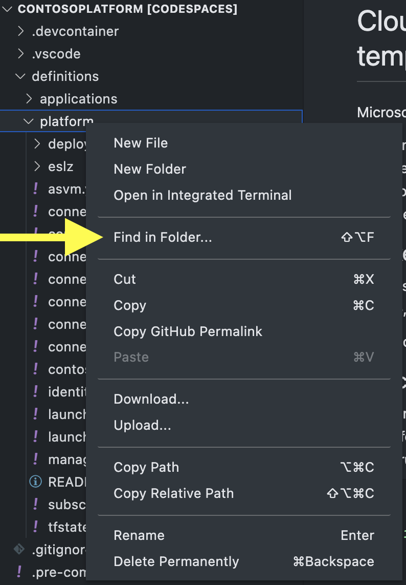
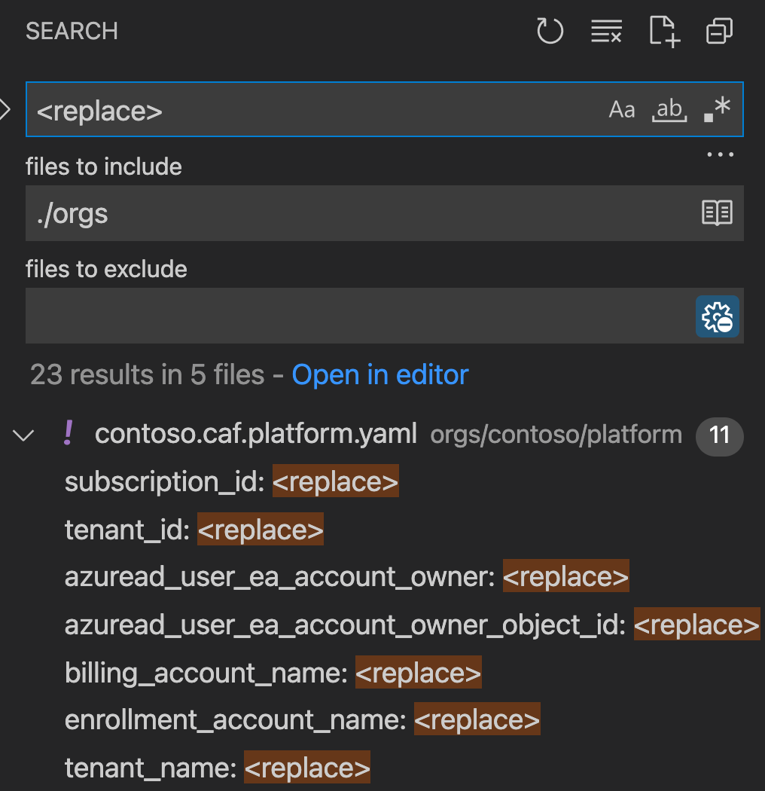

import ReactPlayer from 'react-player'

# Setup your organization


## Organize your private repository

The first step is create a private repository in your current organization. It has to be a git repository.

The video bellow shows you how to setup a private Gihub repository you are going to use to store the configuration of yout platform landingzones.

<ReactPlayer controls url='https://youtu.be/1tbXXOM1s-o' />

### Clone the repository

Clone the private repository on your local machine

```bash
# Adjust the name of your organization
github.com % git clone git://github.com/<org>/contoso contoso && cd contoso
```

```bash
Cloning into 'contoso'...
remote: Enumerating objects: 429, done.
remote: Counting objects: 100% (429/429), done.
remote: Compressing objects: 100% (320/320), done.
remote: Total 429 (delta 110), reused 307 (delta 77), pack-reused 0
Receiving objects: 100% (429/429), 2.93 MiB | 1.52 MiB/s, done.
Resolving deltas: 100% (110/110), done.
```

```bash
# Open visual studio code from the contoso folder
contoso % code .
```

Trust the repository

 

### Visual Studio code

Visual Studio code should open your cloned repository and display the following structure.


### Add remote development extension

Select the **Remote - Containers** extension and click Install.


### Re-open vscode in the dev container

Click on the green bottom left button
From the menu select the option


Open a zsh terminal to get a better understanding of the folders and branch you are using.


You should now see the following terminal. This terminal is where you will run all terminal commands described in this on-boarding tutorial.



### Rename the default branch to main

```bash
➜  caf git:(starter) git checkout main                  
Switched to branch 'main'
➜  caf git:(main)
```

```bash
➜  caf git:(main) git push --set-upstream origin main

Enumerating objects: 103, done.
Counting objects: 100% (103/103), done.
Delta compression using up to 2 threads
Compressing objects: 100% (89/89), done.
Writing objects: 100% (98/98), 53.35 KiB | 420.00 KiB/s, done.
Total 98 (delta 24), reused 0 (delta 0), pack-reused 0
remote: Resolving deltas: 100% (24/24), completed with 3 local objects.
remote: 
remote: Create a pull request for 'main' on GitHub by visiting:
remote:      https://github.com/<org>/contoso/pull/new/main
remote: 
To github.com:<org>/contoso.git
 * [new branch]      main -> main
Branch 'main' set up to track remote branch 'main' from 'origin'.

➜  caf git:(main) 

```

### Clone the CAF Terraform landingzones code

:::note
The CAF Terraform landingzones framework assumes the landingzones Terraform code is cloned in a repository called landingzones.
:::

:::caution
Do not use another name as **landingzones**
:::

```bash
➜  caf git:(starter) ✗ git clone https://github.com/Azure/caf-terraform-landingzones.git landingzones
```

```bash
Cloning into 'landingzones'...
remote: Enumerating objects: 9067, done.
remote: Counting objects: 100% (393/393), done.
remote: Compressing objects: 100% (281/281), done.
remote: Total 9067 (delta 161), reused 295 (delta 108), pack-reused 8674
Receiving objects: 100% (9067/9067), 11.65 MiB | 6.83 MiB/s, done.
Resolving deltas: 100% (5792/5792), done.
Updating files: 100% (406/406), done.
```

```bash
# Go to the landingzones folder
➜  caf git:(starter) ✗ cd landingzones 

# Note all folders are starting with /tf/caf in the devcontainers. 
➜  landingzones git:(master) ✗ pwd
/tf/caf/landingzones
➜  landingzones git:(master) ✗ 
```

### Switch the landingzone branch

The CAF Terraform landingzones are released on regular basis. In order to align the deployment instructions, you need to make sure the Terraform code is also using the correct branch or tag.

From the terminal execute
```bash
➜  landingzones git:(master) git checkout 2112.int
Branch '2112.int' set up to track remote branch '2112.int' from 'origin'.
Switched to a new branch '2112.int'
➜  landingzones git:(2112.int) ✗ 
```

:::note
The branch name in parentheses has changed from **master** to **2112.int**
:::

## Setup the orgs folder

The framework uses a folder called **orgs** stored in the devcontainer at the folder **/tf/caf/orgs**.

The orgs folder must be created at the root of your private repository. It can host different configuration of your platform landingzones. 
For example, you can setup an engineering and production to represent two master configuration where you can first test the configuration and setting in the engineering platform landingzones and then when validated, move that configuration into the production. This is an approach using a mono-repo but some customers would prefer to have different config git repo to separete engineering from production. More documentation on this topics will come soon. 

### Copy the Contoso template configuration

```bash
mkdir -p /tf/caf/orgs/contoso          
```
```bash
cp -R /tf/caf/landingzones/templates/enterprise-scale/contoso/platform \
      /tf/caf/orgs/contoso/platform
```

You can now see the following folder structure created in you local repository.



You can explore the content of this folder and get more details on the files and folders.

### Customize the templates

To customize the templates and getting starting quick, you can use teh find in folders feature



Search for the term **<replace\>**



You can now select each items and adjust the values accordingly.


Go to the next page to learn how to customize the default template.
