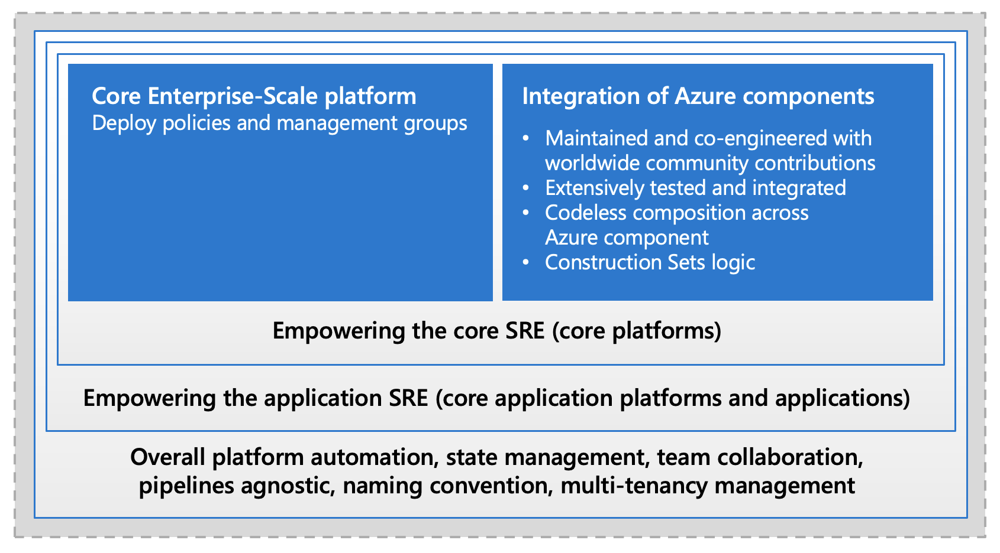

import ReactPlayer from 'react-player'

# Welcome to Cloud Adoption Framework Landing zones for Terraform

CAF Terraform landing zones is a framework to run complex Infrastructure-as-Code projects on Microsoft Azure. We provide public open-source artifacts where the community can build on GitHub. All components are curated by our experts and the community and are published and verified on the Hashicorp registry.

Those components are here to help you to put DevOps to work and evolve the operating model of your organization towards Site Reliability Engineering (SRE) model.

The following video is a good introduction of what CAF Terraform landing zones are, and what are the main components it defines or uses:

<ReactPlayer playing controls url='https://www.youtube.com/embed/FlQ17u4NNts' />

## Empowering the Site Reliability Engineer

Cloud Adoption Framework for Azure - Terraform landing zones offer an enterprise approach to deploy architecture design and implement best practices of enterprise-scale with either default values or high degree of customization.

CAF Terraform landing zones don't define Azure architecture concepts, they are coming from enterprise-scale, but enable them in the DevOps/GitOps context, empowering the Site Reliability Engineering functions.

In order for the components to be robust enough, we decomposed the following features for Site Reliability Engineering:

*Figure 1: An overview of the Site Reliability Engineering Functions covered by CAF Terraform*

## Leverage battlefield-tested artifacts

As part of CAF, the different functions explained above are split across multiple components. That level of decomposition and de-correlation might be confusing at the beginning, but actually allows a maximum of flexibility and reusability of the components whether you're using the complete CAF Terraform landing zones, or you want to use the battlefield-tested CAF module in your own pipelines or Terraform Cloud, or benefit from the CAF naming provider inside your own enterprise-grew modules.  

*Figure 2: An overview of the Site Reliability Engineering Components provided by CAF Terraform*