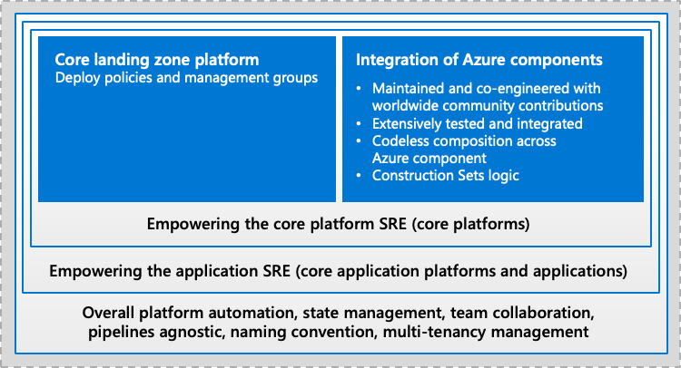

import ReactPlayer from 'react-player'

# Welcome to Azure Terraform SRE Landing zones for Terraform

Azure Terraform SRE landing zones is a framework to run complex Infrastructure-as-Code projects on Microsoft Azure. 
We provide public open-source artifacts where the community can build on GitHub. All components are curated by our experts and the community and are published and verified on the Hashicorp registry.

Those components are here to help you to put DevOps to work and evolve the operating model of your organization towards Site Reliability Engineering (SRE) model.

The Azure Terraform SRE framework has been designed to minimize the Terraform code you need write in favour of writing an object model that describes your infrastructure services. This data model or configuration is processed by a heavy tested Terraform module to deploy those services.
The main goal of the Azure Terraform SRE framework is to leverage Infrastructure-as-Data (IaD) instead of Infrastructure-as-Code (IaC) in order to help our enterprise customers to lower their adoption to automation as code by using an open-source, community-driven tested framework they can use by only writing configuration files in yaml or tfvars.

As an open source framework, we welcome PR from Terraform contributor to augment the depth and breath of the CAF module to build richer infrastructure solutions as code.

The following video is a good introduction of what Azure Terraform SRE landing zones are, and what are the main components it defines or uses:

<ReactPlayer controls url='https://www.youtube.com/embed/FlQ17u4NNts' />

## Empowering the Site Reliability Engineer

Azure Terraform SRE for Azure - Terraform landing zones offer an approach for complex organizations to deploy architecture design and implement best practices of enterprise-scale with either default values or high degree of customization.

Azure Terraform SRE landing zones don't define Azure architecture concepts, they are coming from Azure Landing zones (formerly called enterprise-scale), but enable them in the DevOps/GitOps context, empowering the Site Reliability Engineering functions.

In order for the components to be robust enough, we decomposed the following features for Site Reliability Engineering:

*Figure 1: An overview of the Site Reliability Engineering Functions covered by Azure Terraform SRE*

## Leverage battlefield-tested artifacts

As part of CAF, the different functions explained above are split across multiple components. That level of decomposition and de-correlation might be confusing at the beginning, but actually allows a maximum of flexibility and reusability of the components whether you're using the complete Azure Terraform SRE landing zones, or you want to use the battlefield-tested CAF module in your own pipelines or Terraform Cloud, or benefit from the CAF naming provider inside your own enterprise-grew modules.  

*Figure 2: An overview of the Site Reliability Engineering Components provided by Azure Terraform SRE*