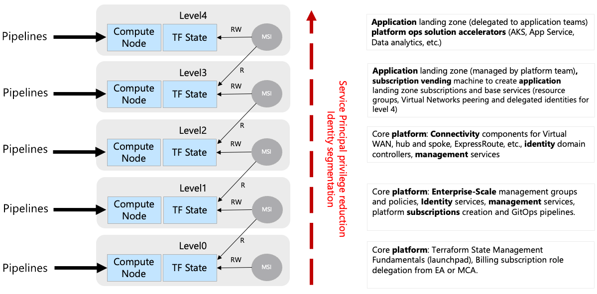
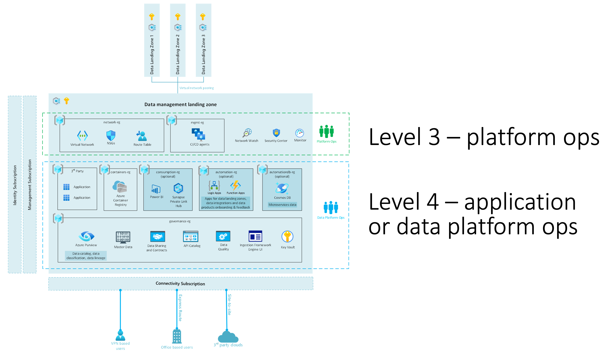
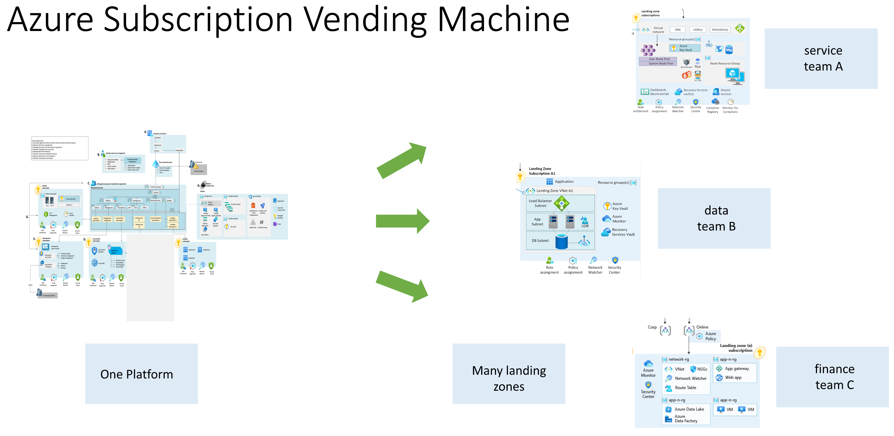

# Levels Hierarchy

To address enterprise complexity, we recommend isolating and decomposing a complex environment in multiple state files.

The main concern with state files is related to security, as a Terraform state file might contain credentials, security tokens, keys etc. It is reasonable that state files corresponding to different levels of privileges are stored separately.

Another concern with state file, which calls for segregation, is the speed of innovation: When someone is conducting a change for a resource in a given state file, no-one else can change the state file at the same time, so having a limited number of state files can hinder the testing or integration processes in the enterprise.

Finally since DevOps is building in teams, we want to unlock autonomy of teams yet delegating some functions (application teams will not re-invent the networking layers but build on it). It will mean the capability to read a state file to do rich composition but without the possibility to alter the state file from other teams.

In CAF Terraform landing zones, separating the Terraform state files enables you to:

- **Control blast radius**: if one configuration is deficient, it only impacts one landing zone and does not compromise the whole environment.
- **Enforce standard configuration**: by using different Terraform state, you can compose a complex environment very fast.
- **Enable autonomy**: different landing zones can enable innovation and features at different pace from each other.
- **Least privilege principles**: Each level is protected by its own identity to prevent unwanted information disclosure and modifications.

## The levels approach

We categorize and store state files into *levels*.

A level groups together a set of state files that needs separation because of different **lifecycles** or **privileges**.

The model can be summarized as below:

*Figure 1: An overview of the levels proposed by CAF Terraform landing zones to structure Terraform states*

The core principles are:

- **One level can host multiple state files**: A level is implemented as an Azure storage account with specific permissions, you can store as many Terraform state files as necessary on a particular level.
- **Rover helps you locate the right storage account**: Whether you are running CAF landing zones locally or in pipeline, rover helps you locate the right storage account for a given environment and level. Authorization to deploy at a level is granted by Azure RBAC model and enforced at runtime (with the current logged in user credentials, or via the pipeline credentials).
- **You can only write in your current level**: at a given level, you can only write the Terraform state file that you are responsible for.
- **Read one level down**: at any particular level, you are able to read information one level down for your composition (one AKS cluster at level 3 can read the Terraform state file at level 2 to compose).
- **Codeless state reading and enterprise composition**: CAF Terraform landing zones come with an object model that allow to load any landing zone (given principal accessing it has access ) in memory and compose from it.

Cloud Adoption Framework for Azure proposes a hierarchy of landing zones based on five levels as described below:

### Level 0: Core platform automation

The different landing zones represented in different state files at level 0 would typically be:

- The **launchpad** (storage accounts, Key Vault, RBAC, etc.) components related to Terraform state management.
- The **subscription creation delegation** capabilities derived from the [Enterprise Agreement](https://docs.microsoft.com/azure/cost-management-billing/manage/ea-portal-get-started) or [Microsoft Customer Agreement](https://docs.microsoft.com/azure/cost-management-billing/understand/mca-overview).
- The credential rotation mechanisms and role-based access control core models.

### Level 1: Core platform governance

The different landing zones represented in different state files at level 1 would typically be:

- The **Azure landing zone** (management groups, policies) this would include the core ALZ (formerly called enterprise-scale) capabilities with the related custom management group structures and policies configuration. You can either use the out-of-the-box settings for Azure LZ or customize the values for your organization.
- The **GitOps services** for core platform automation: creating the pipelines, creating the Virtual Network and compute nodes (see below) required for the DevOps self-hosted agents.
- The **platform subscription creation** for core platform (to create the core enterprise-scale subscriptions like Identify, Management, Connectivity etc.)
- The **management subscription services** for core platform capabilities such as log management, Azure Monitor capabilities, etc.
- The **identity subscription services** for core platform such as domain controller virtual machines, Azure Active Directory Domain Services, Azure AD Group mappings etc.

### Level 2: Core platform connectivity

The different landing zones represented in different state files at level 2 would typically be:

- The **connectivity subscription components**: including the virtual networking components like classic Virtual Network-based Hub and Spoke, Azure Virtual WAN, Azure Virtual WAN regional hub, site-to-site, point-to-site and ExpressRoute connectivity objects, or third parties Network Virtual Appliances. Due to their regional nature, it is likely that each of those components would live inside a different Terraform state file.
- Additional **identity subscription services**: could be Azure Active Directory Domain Services (managed AD), or Virtual-machine-based domain controllers.
- Additional **management subscription services**: could be System Center Configuration Manager, Shared Imaged Galleries, Monitor Alerts or third parties management tools.

### Level 3: Application landing zones vending machine

A landing zone for application is split between two levels. Level 3 includes components of an application that are typically delegated to platform operations teams.

Capabilities in level 3 would be:

- The **application subscriptions creation**: capability to create subscriptions for various environments: Development, Test, UAT, DR, etc.
- The **privileged infrastructure services**: to support the application platform. This would usually include components like virtual network blocks, virtual network peering objects to hubs, route tables and delegated identities (to deploy level4 services and whenever applicable applications deployment credentials).

### Level 4: Applications landing zone

This level contains the application configuration **delegated for application teams**.

It contains for example Azure Kubernetes Services Cluster, API Management services and all its dependency to deliver a service. This can be sourced from Azure landing zones solution accelerators, a custom solutions implemented using CAF module or any other Terraform code.

The following pictures illustrates the split between level 3 and 4:

*Figure 2: Example of Data and AI landing zone for level 3 and 4*

The broader picture on the complete environment would look like that:

*Figure 3: Subscription Vending Machine Example*

### Operating with levels

A deployment will typically contain:

- A couple of level 0 landing zones.
- Few level 1 and 2 landing zones.
- Many level 3 landing zones.
- Many level 4 applications will exist in an environment.

For a given level in the environment, each compute node (see below) will be assigned an identity (see below) that will be used to authenticate and authorize operations on:

- The target Azure Subscription
- The Terraform state file: will be Read and Write permissions for the current level, will be Read only permissions for a "lower" level type of landing zone, avoiding alterations on more privileged environments.

In the example above, each pipeline will have its lifecycle management:

- Level 0 and 1 will be called when updating the core platform.
- Level 2 will be triggered when you are opening a new regional hub, or adding connectivity capabilities.
- Level 3 will be triggered when you deploy a new service (Application Gateway, App Service Environment, Azure Kubernetes Services, etc.)
- Level 4 can be initiated as many times a day as you deploy code in your application environment.

An enterprise environment will consist of a series of pipelines enforcing the different types of environments in different subscriptions.

