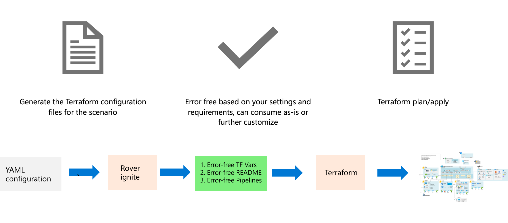

# Rover Ignite

## Introduction to rover ignite

We know that creating a coherent stack of configuration files for an organization can be error-prone. Rover ignite is an iterative tool to get you started with various configurations and creates for you the set of files needed to deploy a complete environment.

### Overview

Rover ignite commands will take the templated configuration files, and will generate for you the different elements according to your settings, including the readme files.



### Languages

Rover ignite is ingesting YAML files as templates that will generate both the tfvars files, readme and soon pipelines.

### Command reference

Typical rover ignite command looks like this (however, generally speaking across CAF, we will give you specific instructions on how to use it best):

```bash
rover ignite \
  --playbook /tf/caf/landingzones/templates/platform/ansible.yaml \
  -e base_templates_folder=/tf/caf/landingzones/templates/platform \
  -e resource_template_folder=/tf/caf/landingzones/templates/resources \
  -e config_folder=/tf/caf/definitions/single_reuse/platform \
  -e landingzones_folder=/tf/caf/landingzones
```

Reference arguments:

| Argument                    | Required | Description                                                                                                                                       |
|-----------------------------|----------|---------------------------------------------------------------------------------------------------------------------------------------------------|
| -playbook                   | yes      | Path to the root configuration Ansible playbook.                                                                                                  |
| -e base_templates_folder    | yes      | Path to the set of Ansible templates for the platform Terraform landing zone.                                                                     |
| -e resource_template_folder | yes      | Path to the set of Jinja templates used for Azure resources instantiation.                                                                        |
| -e config_folder            | yes      | Path to the set of functional templates for landing zones - depending on the scenario you pick from the templates directory inside landing zones. |
| -e landingzones_folder      | yes      | Path to root of landing zones logic folder.                                                                                                       |